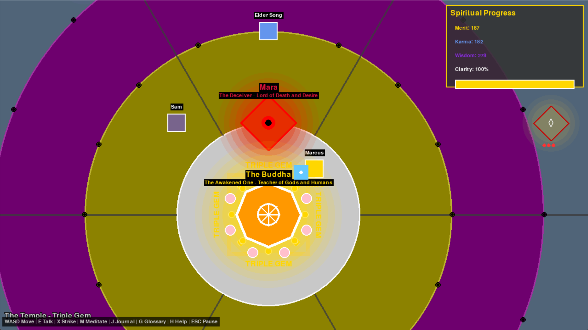

# Samsara: Journey to the Triple Gem

A top-down 2D Buddhist RPG where every moral choice shapes your soul. Navigate six realms of existence, help suffering beings, face Mara, and find refuge in the Triple Gem.

🎮 **Play in browser:** https://mungmanbaoisan.itch.io/samsara-triple-gem-game

## What It Does

- Explore six Buddhist realms — Hell, Hungry Ghost, Animal, Human, Asura, Deva — as concentric circles on a world map
- Talk to suffering beings and make moral choices that grow your Merit, Karma, and Wisdom
- A fog of ignorance hides the world until your wisdom grows and your vision clears
- Face Mara (the demon of delusion), then seek the Buddha to win
- Meditate, keep a journal, read a Buddhist glossary, and unlock achievements along the way

## Built With

- **Python / Pygame** — the game engine
- **Pygbag** — converts the game to WebAssembly (the technology that lets it run in a browser)
- **Itch.io** — where the game is hosted and played

## How to Run It

**In the browser (easiest):**
Go to https://mungmanbaoisan.itch.io/samsara-triple-gem-game and click **Play in browser**. Works in Chrome and Edge.

**On Windows:**
1. Download the zip from itch.io or the [GitHub Release](https://github.com/MungManBaoIsan/samsara-triple-gem-game/releases/tag/v1.0)
2. Unzip and double-click `Samsara.exe` — no Python or installation required

> The standalone Windows build is packaged with PyInstaller, which bundles the Python runtime and all dependencies into the zip. If you're a developer and already have Python + Pygame installed, you can also run `main.py` directly.

## My Journey

**2026-05-29 — Added browser play; fixed lag and visual bugs**
Made the game playable in the browser using Pygbag (WebAssembly). Fixed audio blocking the loader, a browser security header preventing Python from loading, per-frame surface creation causing severe lag, and a font rendering bug that showed capital I instead of lowercase i. Restored all visual effects (fog, NPC auras, world atmosphere) using surface caching so performance stayed smooth.
Key lesson: browser environments are strict about audio and cross-origin security in ways desktop never is. Diagnose from the console, fix one blocker at a time.

## What's Next

- Add background music that plays after the first user click (browser audio rules require this)
- Mac and Linux builds via GitHub Actions
- Mobile-friendly controls for browser play on phones
